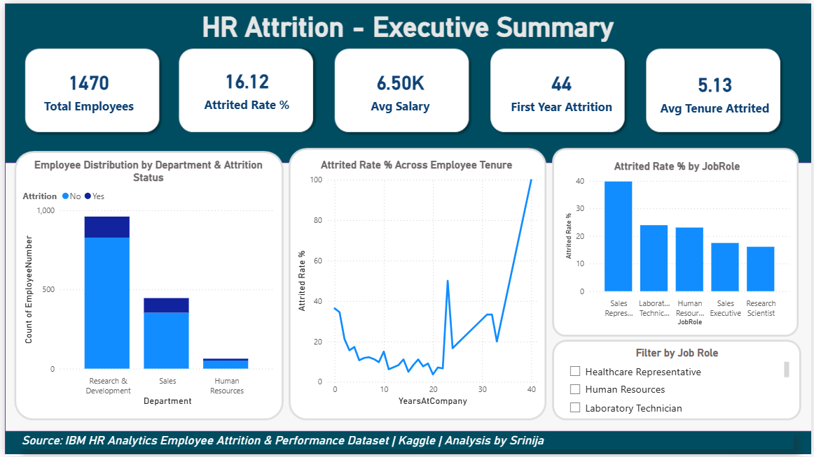
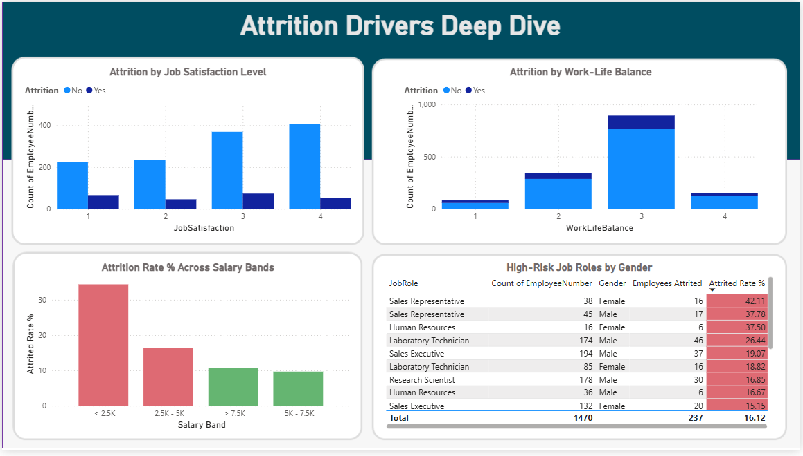
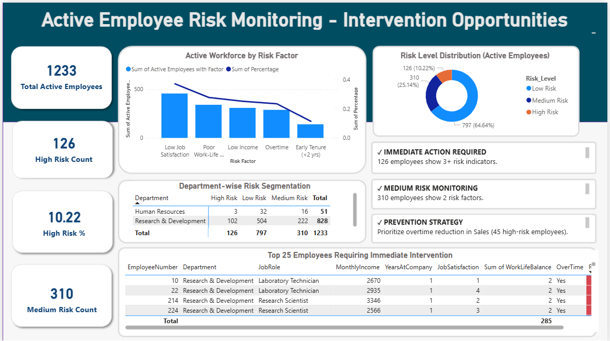

# HR Attrition Early Warning System

## Problem Statement
IBM HR dataset shows **16.12% employee attrition** (237 of 1,470 employees). This represents significant organizational cost in rehiring, training, and productivity loss. 

This project identifies the key factors associated with employee attrition and builds a rule-based Early Warning System that segments active employees by risk level, enabling HR teams to prioritize proactive retention efforts.

## Dataset
- **Source:** IBM HR Analytics Employee Attrition & Performance (Kaggle)
- **Employees:** 1,470
- **Features:** 35 demographic, work, and satisfaction metrics
- **Time Period:** Historical cross-section
- **Target:** Attrition (Yes/No)

## Tools & Technologies
- **Python:** Pandas, NumPy, Matplotlib, Seaborn (EDA, statistical analysis, risk scoring)
- **SQL:** MySQL (9 business-focused analytical queries covering cohorts, risk segments, and workforce trends)
- **Power BI:** DAX measures, data modeling, multi-page interactive dashboard
- **Analytics Framework:** Historical attrition analysis + rule-based Early Warning System

---

## Key Findings

### Finding #1 — First-Year Attrition Risk
- **37% of employees in year 0** depart (44 of 119 first-year hires)
- Attrition drops to **10-15% by year 2+**
- **Business Impact:** Onboarding attrition is the #1 controllable leakage point
- **Action:** Implement structured mentorship + 90-day check-in protocol

### Finding #2 — Job Satisfaction is the Primary Driver
- Employees with **low satisfaction (score 1-2): 38.8% attrition**
- Employees with **high satisfaction (score 4): 6.5% attrition**
- **Statistical Significance:** p < 0.0001 (highly significant)
- **Business Impact:** 3.2x attrition multiplier
- **Action:** Quarterly engagement surveys + immediate manager intervention for low scorers

### Finding #3 — Compensation Gap Among Leavers
- Attrited employees earn **₹4,787/month average**
- Retained employees earn **₹6,832/month average**
- **Salary Gap:** ₹2,045/month (30% difference)
- **Business Impact:** Undercompensation drives departure, especially in Sales roles (40% attrition)
- **Action:** Conduct market salary benchmarking; review Sales/IT compensation tiers

### Finding #4 — Overtime as a Burnout Indicator
- Employees working overtime: **30.5% attrition**
- Employees without overtime: **10.1% attrition**
- **Business Impact:** 3x attrition multiplier
- **Action:** Review project allocation; redistribute workload in high-overtime departments (Sales: 45 at-risk)

### Finding #5 — Active Employee Risk Segmentation
- **High Risk (3+ factors): 126 active employees (10.22%)**
  - Combination of: low tenure + low satisfaction + overtime + low salary
  - Concentrated in Sales (21), R&D (102)
- **Medium Risk (2 factors): 310 employees (25.14%)**
  - Monitor quarterly; preventive engagement
- **Low Risk: 797 employees (64.64%)**

---

## Business Recommendations

| Priority | Recommendation | Expected Impact | Timeline |
|---|---|---|---|
| 1 | **Onboarding Overhaul** — Implement 90-day mentorship + manager check-ins for all Year 0 hires | Reduce first-year attrition from 37% to 15% | 3 months |
| 2 | **Compensation Review** — Market salary analysis for Sales/IT roles; close ₹2K+ gaps | Reduce departure of mid-tier talent | 2 months |
| 3 | **Overtime Reduction** — Cap weekly overtime; redistribute workload in Sales/R&D | Prevent burnout-driven departures | Ongoing |
| 4 | **Engagement Program** — Quarterly satisfaction surveys + immediate manager check-in for scores ≤2 | Improve satisfaction; prevent cascade departures | Monthly |
| 5 | **Active Risk Monitoring** — Flag 126 high-risk employees; assign HR business partner touch-points | Proactive retention of key talent | Immediate |

**Expected Business Value:** By prioritizing high-risk employees and addressing major attrition drivers such as overtime, low satisfaction, and early-tenure disengagement, HR teams can proactively improve employee retention and reduce recruitment and onboarding costs.
---

## Dashboard Overview

### Page 1: Executive Summary
- Overall attrition metrics and organizational overview
- First-year attrition spike visualization
- Department-level accountability
- High-risk role identification

### Page 2: Attrition Drivers Deep Dive
- Job satisfaction correlation (strongest predictor)
- Compensation level impact
- Commute distance analysis
- Role-specific attrition rates with gender breakdown

### Page 3: Active Employee Risk Monitoring ⭐
- Segmentation of 1,233 active employees into Low, Medium, and High Risk groups
- Identification of 126 high-risk employees for immediate HR intervention
- Department-wise distribution of workforce risk factors
- Interactive employee-level monitoring table
- Actionable retention recommendations for HR stakeholders

---

## Project Structure

HR-Attrition-Early-Warning-System/
│
├── notebooks/

│   └── pandas_analysis.ipynb

├── sql/

│   └── hr_attrition_queries.sql

├── outputs/

│   ├── hr_attrition.pbix

│   └── hr_attrition_analysis.pdf

│   ├── Executive_Summary.png

│   ├── Attrition_Drivers.png

│   ├── Active_Employees_Risk_Assessment.png

└── README.md

└── .gitignore

└── LICENSE

---

## How to Use
1. **Data:** Download `IBM_HR_Analytics.csv` from [Kaggle](https://www.kaggle.com/datasets/pavansubhasht/ibm-hr-analytics-attrition-dataset)
2. **Python:** Run `pandas_analysis.ipynb` to replicate EDA and risk scoring
3. **SQL:** Execute queries in `hr_attrition_queries.sql` for deeper cohort analysis
4. **Power BI:** Open `hr_attrition.pbix` for the interactive dashboard or view `hr-attrition_analysis.pdf` for a static preview.
---

## Key Metrics Summary

| Metric | Value | Insight |
|---|---|---|
| Total Employees | 1,470 | Population size |
| Attrition Rate | 16.12% | Business baseline |
| First-Year Attrition | 37% | Highest-risk cohort |
| Low Satisfaction Attrition | 38.8% | Strongest driver |
| Active Employees | 1,233 | Retention focus |
| High-Risk Active | 126 (10.22%) | Intervention targets |
| Avg Salary Gap | ₹2,045/month | Compensation issue |
| Overtime Attrition | 30.5% | Burnout signal |

---

## Technical Approach

**Data Quality:**
- 0 missing values
- 35 features across demographics, work metrics, satisfaction scores
- Binary target variable: 237 attrited employees vs 1,233 retained employees

**Statistical Methods:**
- Independent t-tests to identify significant predictors (p < 0.05)
- Risk scoring via multi-factor weighting (tenure + satisfaction + compensation + workload)
- Segmentation analysis by department, role, and demographics

**Validation:**
- Pandas analysis findings validated through SQL cohort queries.
- Statistical significance confirmed using independent t-tests (Age, Monthly Income, Years at Company, and Job Satisfaction all p < 0.0001).
- Rule-based risk segmentation designed using historical attrition patterns and business heuristics.

---

## Dashboard Preview

### Executive Summary

### Attrition Drivers Deep Dive

### Active Employees Risk Assessment

---
## Author
**Srinija** | Data Analyst | [GitHub](https://github.com/srinija0208)

**Source:** IBM HR Analytics Employee Attrition & Performance Dataset | Kaggle
